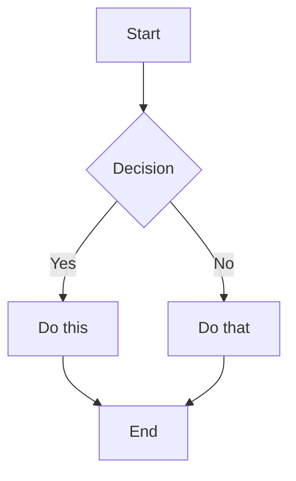
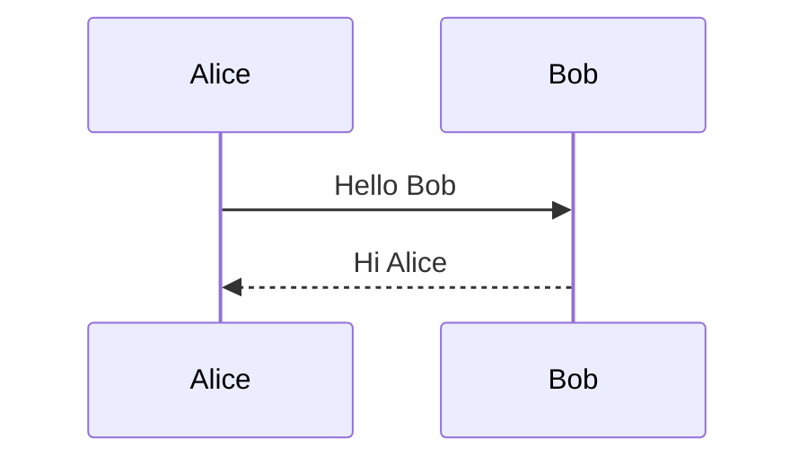
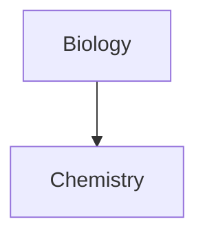

## Diagrams (Mermaid)

````markdown

```mermaid
graph TD
    A[Start] --> B{Decision}
    B -->|Yes| C[Do this]
    B -->|No| D[Do that]
    C --> E[End]
    D --> E
```
````

### Sequence Diagrams

````markdown

```mermaid
sequenceDiagram
    Alice->>Bob: Hello Bob
    Bob-->>Alice: Hi Alice
```
````

### Linking in Diagrams

````markdown

```mermaid
graph TD
    A[Biology]
    B[Chemistry]
    A --> B
    class A,B internal-link;
```
````
